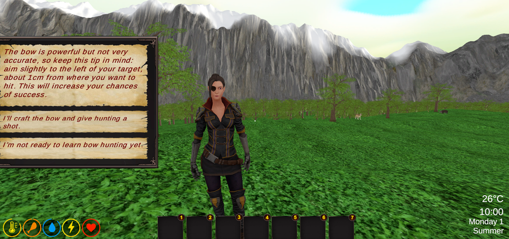
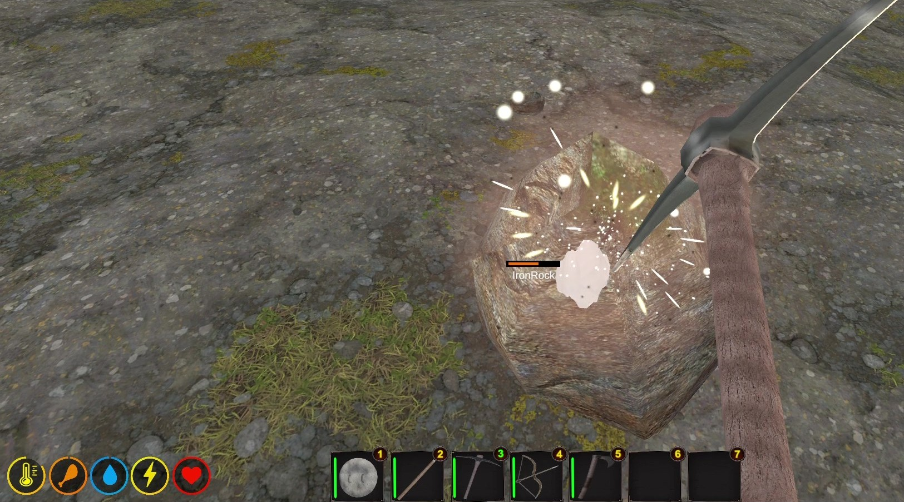
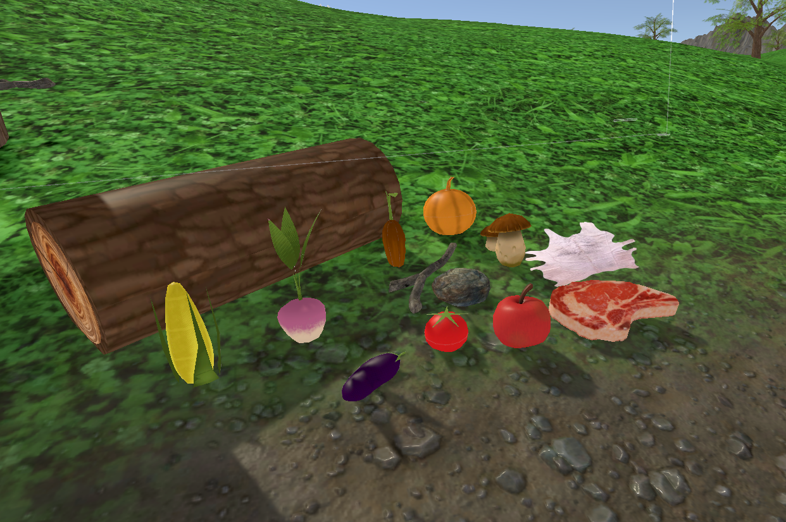
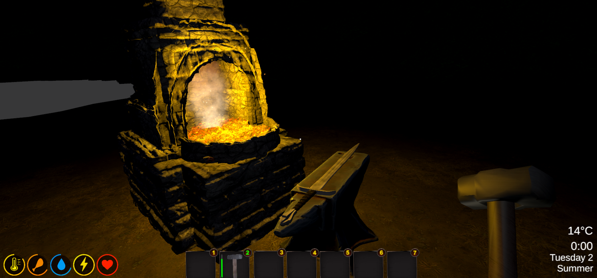
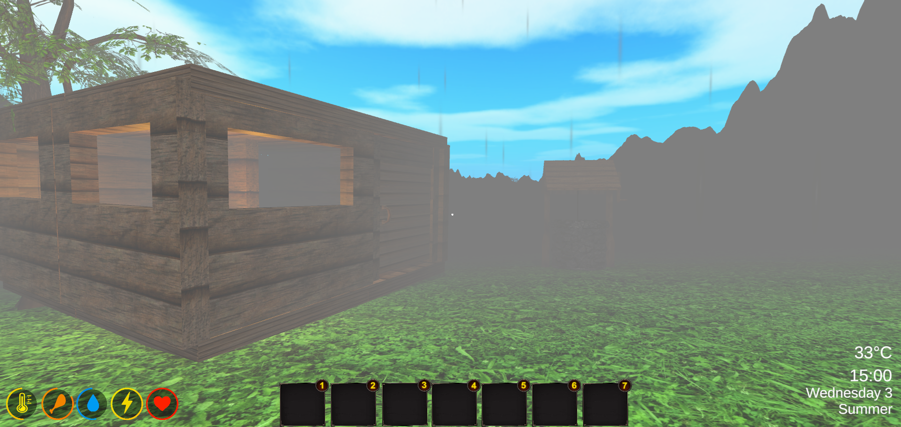
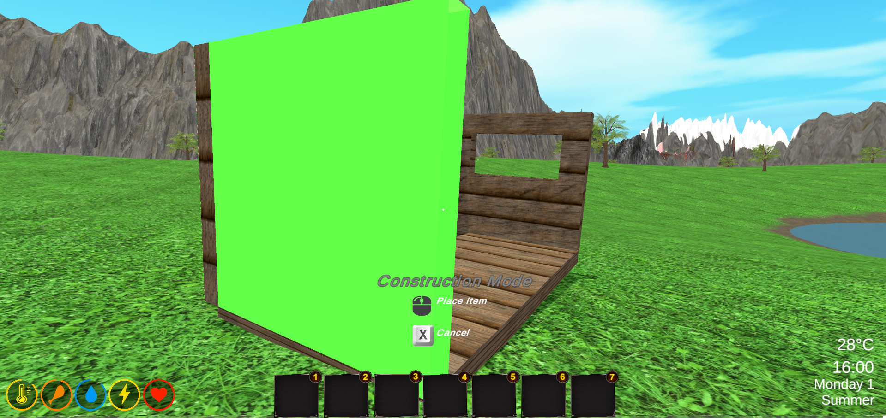
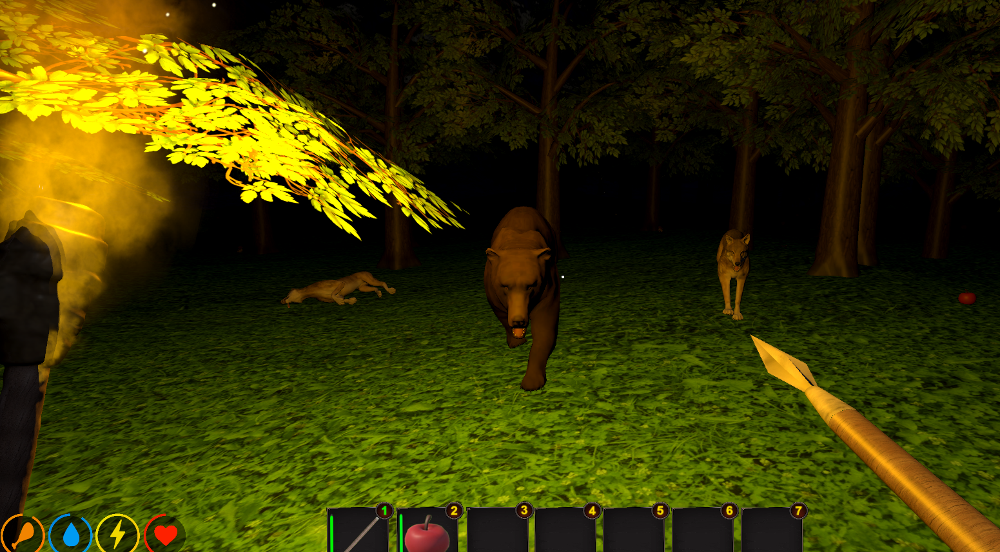
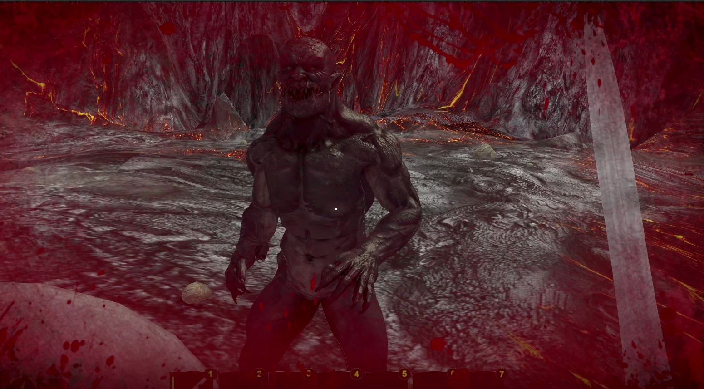

# Try To Survive 🌿

**Try To Survive** is an open-world survival adventure where you wake up in an isolated and wild part of the world.  
You encounter **Maria**, an NPC who offers missions, hints, and survival tips to help you thrive in this unforgiving environment.

Gather resources, hunt, craft weapons, grow food, and defend yourself against wild animals and mysterious monsters.  
Whether you're farming under a peaceful sunset or fighting to survive a cold night, your journey is shaped by how you adapt and build your future.

---

## 🔹 Features
 

## 🧭 NPC  & Mission-Based Survival Tips

The NPC **Maria** guides the player using AI voice-generated text, offering helpful advice and immersive interactions.  
There are a total of **16 quests**, each designed to teach and challenge the player with essential survival mechanics — from basic resource gathering to advanced crafting and combat readiness. 

## Crafting System

A visual of the crafting system when placing a floor.

  
##
 

## 🪓 Resource Gathering & Material Collection

The game features a rich variety of resources essential for survival.  
Some items — such as **water , fruits, vegetables, sticks, and stones** — can be found scattered randomly throughout the world.  
Others must be actively **gathered or farmed** by the player, including **logs (from trees), rocks and ores (from mining), and animal-based materials like fur, skin, fat, and meat**.  
These resources are vital for crafting tools, building shelter, and sustaining life in the wild.

 

  
  

  

##
 

## ⚒️ Medieval Crafting & Realistic Processes

Crafting powerful items like swords, shields, or armor isn’t instant — it requires time, effort, and realism.  
Unlike most modern games, *Try To Survive* emphasizes detailed medieval processes. For example, iron must first be **mined**, then **melted in a furnace**, and finally **forged into shape using a hammer**.  
Other actions include **cooking, skinning, polishing**, and more — each with its own realistic sequence.

##
 

 ## 🌦️ Dynamic World & Realistic Weather System
Vast open-world setting with realistic dynamic day and night cycles, raining, and a temperature system that affects the player's body. (For example, summer days can exceed **35°C**, requiring the player to hydrate more frequently. During cold autumn nights, if not properly dressed or warmed, the player can develop **hypothermia**, leading to slower movement and health loss.)
 (o poza cand ploua si playerul are temperature la mov)
  
##

 

## 🛠️ Advanced Crafting & Base Construction

The game features a **deep crafting system** with over **40 unique items**, including **furniture, tools, weapons, and utility objects** to support survival.  
Alongside this, players can build and customize their own **defensive base**, offering protection against **wild animals** and **hostile creatures**.
(poza cu crafting system + cand pun un floor)

##
 

## 🌾 Farming: Plants & Animals

Survival isn’t just about hunting — it’s also about sustaining.  
The player can **plant vegetables and fruits** to grow reliable food sources over time.  
Additionally, animals found across the map can be **captured, raised, and fed**, turning them into valuable resources for **meat, fur, fat, and more**.

(poza cu porci, gaini, vaci, capre inside fence, + poza cu toate legumele)

##
   

## 🐺 Survival Combat: Wild Animals & Monsters

The world of *Try To Survive* is as dangerous as it is beautiful.  
Players must face **wild animals** like wolves and bears, as well as **mysterious monsters** that appear in the shadows.  
Combat requires strategy, crafted weapons, and quick reactions to stay alive.
(pun o imagine cu un urs care ma ataca noaptea cand am o torta in mana + o poza in care ma lupt cu monstrul de la vulcan) 
  
  